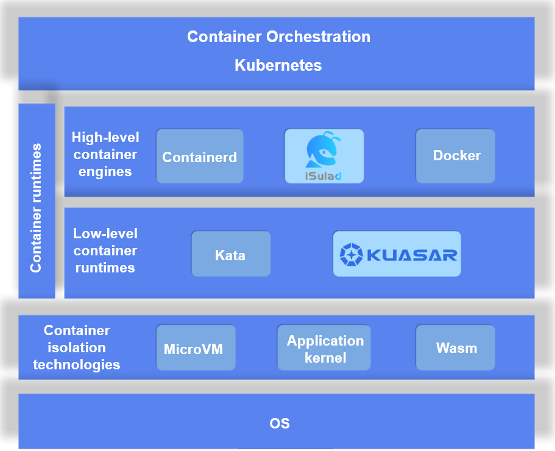
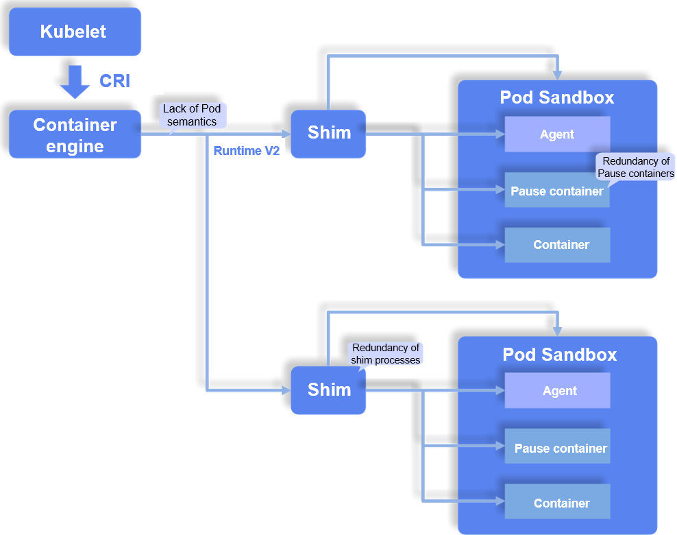
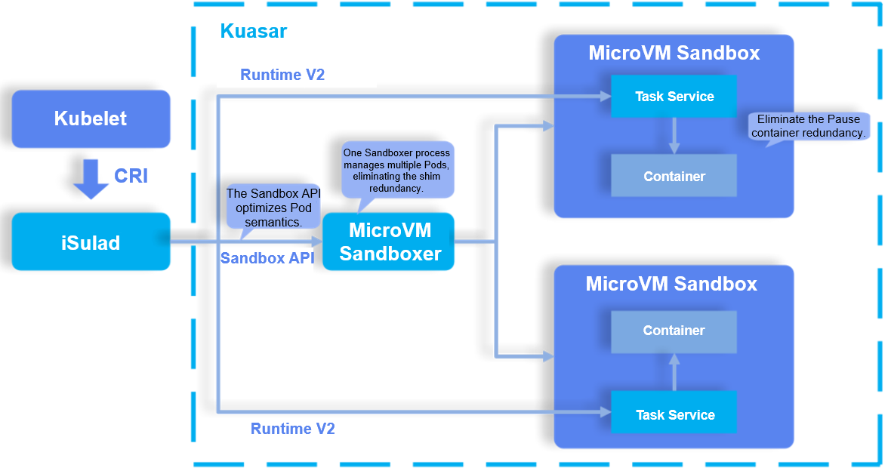
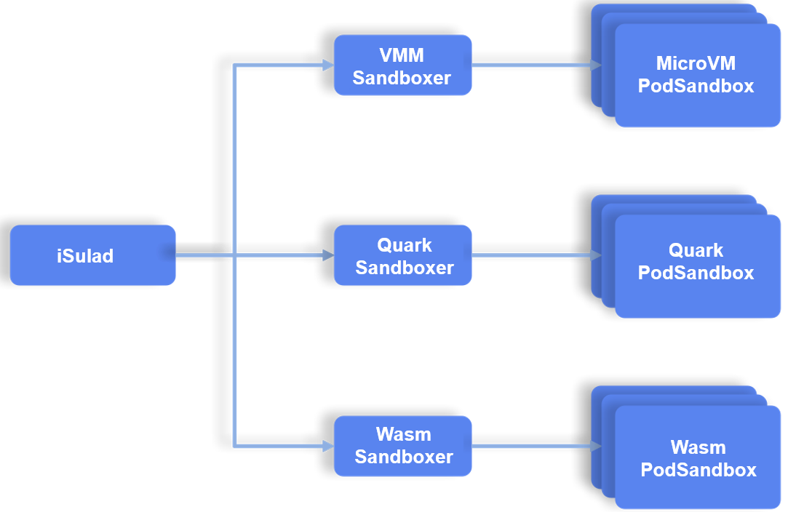

As cloud computing and container technologies continue to evolve, container engines and runtimes have become the solid foundation of the cloud native era. They are responsible for container lifecycle management, and environment setup and resource configuration during container running. The openEuler community is constantly seeking solutions to the container running efficiency, security, and isolation issues based on the iSulad[1] container engine project.  

On April 21, 2023, at KubeCon + CloudNativeCon Europe in Amsterdam, Huawei Cloud unveiled Kuasar[2], a multi-sandbox container runtime that can accurately map the Pod semantics in the Kubernetes [Container Runtime Interface (CRI)](https://github.com/kubernetes/cri-api) standard to the sandbox semantics of Kuasar. Meanwhile, the iSulad container team worked closely with Huawei Cloud Kuasar and took the lead in supporting Kuasar's sandbox semantics, implementing full-stack interconnection between Kubernetes, iSulad container engines, and Kuasar unified container runtimes.   
The iSulad and Kuasar projects helped unify the Kubernetes ecosystem scenarios of container runtimes to cope with different container isolation technologies, and simplify the unified deployment of multiple containers (or sandboxes) on a single node. Compared with the Containerd + Kata-Containers runtime combination, iSulad + Kuasar **not only supports various container isolation technologies, but reduces the memory consumption of runtime management components by 99% and the parallel startup time by over 40%**.

# Background and As-Is

>

In terms of the container orchestration component Kubernetes, a server that can process CRI requests is a container runtime. Actually, container runtimes can be further divided into container engines and low-level container runtimes.  

A container engine sets up the container operating environment, configures container resources, and manages the container lifecycle. Its northbound interface receives inputs from Kubernetes or the frontend command line, and the southbound interface calls the low-level container runtime to generate the final container environment and complete the container lifecycle.  

The terms container engine and container runtime are often used interchangeably in the industry. **[But in the semantics of this blog, a container runtime refers specifically to the low-level container runtime.]** In addition to iSulad, container engines also include Containerd and Docker, and low-level container runtimes include runC and Kata Containers.  

These container engines and runtimes have many known issues due to certain historical reasons. These issues are mainly caused by the fact that the container engines and runtimes cannot properly handle Pod semantics in the CRI. The following figure uses MicroVM as an example
to describe some major issues in container and container runtimes.  

>

## 1. Lack of Pod Semantics

The Kubernetes CRI specification strengthens the concepts of Pod and sandbox and uses a Pod as the minimum unit for container orchestration and scheduling. A Pod is a group of one or more containers that share certain namespaces and resources. A sandbox provides a secure and isolated operating environment for the group of containers using container isolation technologies. However, the Pod semantics are not well reflected at the container engine and runtime layers. As a result, architectures of these components are improper, increasing the implementation complexity and causing many maintenance problems, such as the management and maintenance of shim processes and I/O channels.  

## 2. Redundancy of Shim Processes

During Pod creation using the shim v2 standard, each time a Pod is created, a shim process needs to be started to manage the Pod and its resources. This causes the following problems:  

-   Memory resource consumption: The shim processes consume a large number of memory resources. According to the test result, in the Containerd + Kata combination, each time a Pod is added, the memory consumption of management-layer components caused by the shim process increases by about 18 MB.  

-   Prolonged startup time: Shim processes prolong the call chain of container lifecycle management, which increases the startup time and consumes more CPU resources.  

-   Increase in reliability problems: In large-scale commercial practices, reliability problems trouble many commercial container teams. These problems not only affect normal service running, but are difficult to locate and solve. The shim processes cause a large number of similar problems, such as status inconsistency, data flow suspension, and residual processes, which greatly increase the container maintenance cost.  

## 3. Redundancy of Pause Containers

Due to historical reasons, early commonly-used containers use Linux namespaces and cgroups to implement resource isolation and restriction. A Pause container is a special container created for those early containers to cope with Pod semantics in the CRI. It mainly creates namespaces and restricts shared resources based on specific configurations. However, the Pause container does not do any actual work but consumes CPU time and memory resources. Moreover, the presence of the Pause container increases the attack surface of the system, which can potentially lead to security risks. With the use of advanced container isolation technologies, it is possible to eliminate the need for the Pause container. For example, with the implementation of the virtualization isolation technology, Pause containers are no longer necessary for configuring namespaces and shared resources because VMs can offer robust security and isolation capabilities.

## 4. Limited Isolation Technologies for Container Runtimes

Container isolation technologies have played a crucial role in driving the rapid development of container runtimes. Mainstream container isolation technologies are as follows:  

-   Linux container isolation technology: Linux containers are isolated in namespace + cgroups mode, which features high performance and low overhead. LXC is an early isolation technology. Due to its security and portability problems, LXC is gradually replaced by libcontainer. However, libcontainer has a relatively poor isolation capability, such as that seen with the runC container.  

-   Lightweight virtualization-based container isolation technology: MicroVM is a virtualization-based container isolation technology that utilizes lightweight virtualization techniques to isolate containers, and has strong isolation and security of traditional VMs. However, MicroVM may present some efficiency challenges, such as those seen with QEMU and StratoVirt.  

-   User-mode kernel isolation technology: The user-mode kernel runs most kernel-mode functions in user mode, and implements secure isolation of system calls by using an agent for service process calls. Compared with virtualization, the user-mode kernel is more lightweight and has better performance. However, the user-mode kernel is still in the early development phase, and has many stability, reliability, and compatibility problems, such as those seen with gVisor and Quark.  

-   Language VM-based isolation technology: In essence, this technology loads and runs the underlying bytecodes using a dedicated language VM to achieve isolation. The Wasm VM is a type of language VMs. It uses platform-independent system interfaces (WASIs) to enable Wasm programs to access system resources. The Wasm sandbox boasts fast cold start and low resource overhead, but has many restrictions in use and supports limited languages. It is not mature yet and has many isolation, universality, and language ecosystem issues that have not been resolved.  

There are various container isolation technologies available, each with its own set of advantages and disadvantages in terms of performance, security, and universality. However, most containers currently support only one isolation technology, which restricts the potential advantages of using multiple isolation technologies. Therefore, deploying multi-form sandboxes on a single node is costly and complex.

# iSulad + Kuasar: Next-Generation Unified Container Runtime Solution

To solve the preceding pain points, the openEuler community worked with Huawei Cloud and together launched a new unified container runtime solution. This solution aims to enable the container engine and runtime to properly address the challenges that arise from using the shim v2 standard for Pod lifecycle and resource management.  

>

With the increasing popularity of container isolation technologies, there has been a growing interest in incorporating sandbox semantics into container engines and runtimes. The Containerd community has long started to discuss the introduction of sandbox semantics. The Sandbox API[3] was proposed in March 2020 and officially incorporated into the Containerd community in April 2022.  

Although incorporation of the Sandbox API improves the handling of Pod semantics within Containerd, other shim-related problems still cannot be solved. But now, the iSulad + Kuasar project's deeper innovation in the Sandbox API makes it possible to solve these problems. In the new solution, iSulad functions as a container engine that extends the sandbox API call to use RPC to enable Kuasar, the container runtime, to manage Pods. Different from the original shim v2-based solution, the new solution does not require a shim process created for every Pod. In the new architecture, the same process manages all containers of the same type. For example, MicroVM Sandboxer in the preceding figure is a process used to manage lightweight VMs. iSulad interacts with MicronVM Sandboxer through the Sandbox API to manage the lifecycles of all Pods of a type. Each time a Pod is created, the address of the Task Service in the Pod is returned to iSulad through the Sandbox API. Then iSulad interacts with the Task Service through the shim v2 interface to manage containers in the Pod.  

This new solution perfectly solves the long-standing pain points between the container engines and runtimes.  

1.  **[The sandbox semantics are introduced into the container engines and runtimes]**, ensuring semantic consistency with the CRI and enhancing the continuity on the cloud native architecture.  

2.  Kuasar replaces multiple shim processes in shim v2 with a Sandboxer process. This solves those shim-related problems.  

    -   **[Sandboxer minimizes the redundancy of shim processes, resulting in a significant reduction in the resource overhead. According to the test result, in a scenario with 50 Pods, Kuasar's management-plane overhead is only 1% of that of shim v2.]**  

    -   **[Container creation does not require the shim process proxy. iSulad directly sends container lifecycle management requests to the corresponding Task Service, shortening the startup time by more than 40%.]**  

    -   **[After the shim processes are eliminated, reliability problems such as status inconsistency, data flow suspension, and residual processes will be solved.]**  

3.  In the new architecture, Pods are created through the Sandbox API and do not need to comply with the OCI standard process, **eliminating the redundancy of Pause containers**.  

4.  The new solution **allows multiple types of sandboxes to run on a single node and uses different isolation technologies that can complement each other in terms of performance, security, and universality**.  

>

## iSulad

iSulad is a container engine written in C/C++. It boasts a remarkably low memory overhead, consuming only 50% of the memory required by Containerd. This makes iSulad a lightweight, flexible, and fast solution that can be deployed in a variety of scenarios, including cloud native and embedded environments.  

In the new solution, iSulad has also innovated and adjusted its structure for Pod processing.  

-   Northbound interface: Different from the original method of using container semantics to process Pod management requests, iSulad introduces sandbox semantics into the architecture and implementation and differentiates Pods from containers semantically. This makes iSulad to better support Pod requests of the CRI and command line and provide greater expansion space for the diversity of container forms.  

-   Southbound interface: iSulad extends the Sandbox API to provide a unified interface for different container forms, implementing normalized management. iSulad also provides clearer and more accurate call requests for Kuasar, the container runtime.  

You can use the dev-sandbox branch[4] of iSulad to experience the latest version of iSulad + Kuasar. For details, see the user guide[5].  

The iSulad community will continue to cooperate with the Kuasar community in the evolution of next-generation container runtimes to expand the influence of the multi-sandbox container technology in the industry.  

## Kuasar

The next-generation container runtime Kuasar[6] uses the Sandbox API rather than the shim v2 interface to manage Pods. The Sandbox API not only has a clearer logic, but supports access of multiple sandboxes.  

The Kuasar design introduces the concept of Sandboxer. Each Sandboxer uses its own container isolation technology to manage Pods of the same type. Currently, Kuasar supports multiple Sandboxer implementations, including QEMU, Cloud-Hypervisor, StratoVirt[7] and Quark.  

## openEuler Full-Stack Solution

The openEuler community is actively exploring container engine and runtime technologies from various perspectives. The iSulad project continues to improve in terms of functionality and performance. The lightweight VM StratoVirt focuses on breakthroughs in virtualization technologies. Compared with QEMU, StratoVirt is optimized in memory and startup time. Now, Kuasar, the next-generation unified container runtime jointly developed with Huawei Cloud, is on the right track. The openEuler community has implemented the **[iSulad + Kuasar + StratoVirt**
**full-stack secure container solution].** Compared with the mainstream Containerd + Kata + QEMU solution, this China-made solution greatly improves the overall cluster performance and deployment capability.

# Summary

This new container engine and runtime solution addresses the long-standing pain points of mainstream solutions. It optimizes the semantics of container runtimes and adds the multi-sandbox deployment capability, greatly improving the performance and reliability. The development of functions has been completed, and we are currently working on exploring new features and improving the quality. We welcome you to try it out and provide us with your valuable feedback and suggestions. We will accelerate the maturity of the features and incorporate them into the openEuler LTS version as soon as possible.

 
The openEuler community has always been committed to the principles of openness, cooperation, and sharing in the open source world. We welcome developers from all backgrounds to join us in contributing to container and virtualization projects such as iSulad, Kuasar, and StratoVirt.

## References

\[1\]

**Container engine project iSulad**: [https://gitee.com/openeuler/iSulad](https://gitee.com/openeuler/iSulad)

\[2\]

**Kuasar**: [https://github.com/kuasar-io](https://github.com/kuasar-io)

\[3\]

**Sandbox API**: [https://github.com/containerd/containerd/issues/4131](https://github.com/containerd/containerd/issues/4131)

\[4\]

**dev-sandbox branch**: [https://gitee.com/openeuler/iSulad/tree/dev-sandbox](https://gitee.com/openeuler/iSulad/tree/dev-sandbox)

\[5\]

**User Guide**: [https://gitee.com/openeuler/iSulad/blob/dev-sandbox/docs/manual/sandbox_zh.md](https://gitee.com/openeuler/iSulad/blob/dev-sandbox/docs/manual/sandbox_zh.md)

\[6\]

**Kuasar**: [https://github.com/kuasar-io](https://github.com/kuasar-io)

\[7\]

**StratoVirt**: [https://gitee.com/openeuler/stratovirt](https://gitee.com/openeuler/stratovirt)
