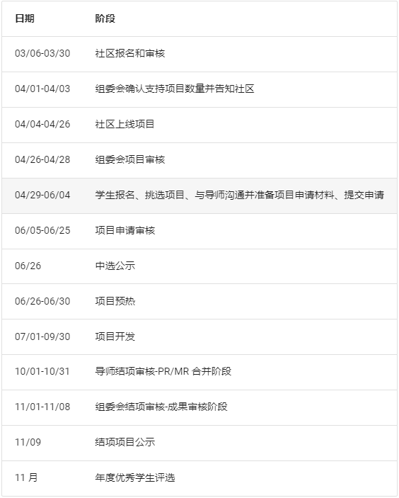

## 关于开源之夏

开源之夏是开源软件供应链点亮计划下的暑期活动，由中科院软件研究所与openEuler社区联合主办，旨在鼓励在校学生积极参与开源软件的开发维护，促进优秀开源软件社区的蓬勃发展。

活动联合各大开源社区，针对重要开源软件的开发与维护提供项目，并向全球高校学生开放报名。学生可自主选择感兴趣的项目进行申请，中选后在项目开发者（社区导师）的指导下进行开发。根据项目的难易程度和完成情况，结项者将获取开源之夏活动奖金和结项证书。

开源之夏官网：https://summer-ospp.ac.cn/

## openEuler Embedded SIG项目介绍

openEuler Embedded SIG致力于openEuler的嵌入式版本（openEuler Embedded）开发，使其能够广泛应用于嵌入式设备。开源之夏2023，openEuler Embedded SIG共发布6个任务，欢迎广大高校学生提交申请，一起构建更好的openEuler嵌入式版本生态！

### 项目一：openEuler Embedded ROS机器人应用生态演进及深度学习场景拓展

**项目描述：**

openEuler Embedded主要面向嵌入式场景，当前已经支持armNN，本项目目标是拓展ROS应用生态，帮助嵌入式ROS的版本演进及深度学习场景的应用突破。

**产出要求：**

- 基于originbot的一个需要AI深度学习的ROS demo（图像识别相关，可任选一个demo，如AI深度学习巡线，见资料）进行移植适配，能够在真机上演示（需自备硬件，建议至少树莓派4B+任何UVC摄像头，可以不需要originbot小车，即对推理结果后的控制不做要求，能够将推理的结果通过ROS节点广播并从PC观测端查看到正确的结果即可），推理框架使用armNN为佳，并提供资料
- 所有ROS2软件包版本需使用humble版本，需对相关软件包进行适配（当前openEuler Embedded的ROS还使用foxy版本，上游社区即将停止维护，涉及存量未切换ROS核心软件包的版本升级、深度学习应用新增软件包的移植引入）

**项目导师：**

fanglinxu  flxu2002@gmail.com

**项目主页：**

https://summer-ospp.ac.cn/org/prodetail/23b970398?lang=zh&list=pro

### 项目二：openEuler Embedded 易用性扩展-快速运行

**项目描述：**

当下openEuler Embedded已经通过oebuild工具实现了构建易用性，但是目前还缺少快速运行调试功能，所谓快速运行调试就是实现一键式交叉编译->调起运行环境->运行代码->输出运行结果，本项目的目标就是依托oebuild平台，在该平台上实现上述功能。

**产出要求：**

- oebuild添加交叉编译扩展命令
- oebuild添加调起qemu运行环境命令
- ebuild添加在指定平台运行程序命令

**项目导师：**

李新宇  992678910@qq.com

**项目主页：**

https://summer-ospp.ac.cn/org/prodetail/23b970445?lang=zh&list=pro

### 项目三：openEuler Embedded 为混合关键系统实现量化分析功能

**项目描述：**

混合关键性系统 (MCS, Mixed Criticality System)，可实现在一颗SoC部署多个OS，同时提供Linux和实时OS的能力。本题目的目标是为mcs实现量化分析功能，具体任务包括：

- **为mcs设计一套 Benchmark，定义client os的性能基线（基础）**
  Benchmark 分析，能够帮助用户直观地观测 mcs 通信框架以及 client os 的性能数据，Benchmark包含的功能如：

   - client os 的延时测试，中断响应时间，上下文切换时间等；
   - OS间的通信测试，包括ping的耗时，长消息和短消息的传输时延，cache影响等；
   - ... ...

- **实现通过 gdb 调试client os（进阶）**
  由于client os和host os在一定程度上是隔离的，client os上的应用调试会变得异常困难，往往只能通过日志打点、Jtag等方式来观测。
  基于mcs实现的 gdb 调试功能，能够帮助用户高效进行client os的应用开发调试，主要的功能点包括：
 - client os 的 gdbstub：包括 添加/删除 断点；打印堆栈；读取寄存器；读取内存；step和continue等功能。
   - host os 与 client os 间的gdb消息通信，类似于当前的 gdb remote/server。

**产出要求：**

- Benchmark功能，适用于mcs的性能基线测试；
- gdb 调试功能，基于ARM64 QEMU混合部署镜像，实现 Linux(host os) 调试 Zephyr(client os)；
- 代码需要符合内核编码规范，有必要的注释，提交信息要详细；
- 补充相关的.rst文档，并提交到yocto-meta-openeuler仓库；

**项目导师：**

韩宗成  hzc04@qq.com

**项目主页：**

https://summer-ospp.ac.cn/org/prodetail/23b970461?lang=zh&list=pro

### 项目四：openEuler Embedded 构建系统优化

**项目描述：**

对openEuler Embedded现有的构建框架进行优化。

- 基础：通过学习yocto构建工程，检视当前openEuler Embedded构建流程存在的的问题，包括文档，提交PR修复；
- 进阶：openEuler Embedded 构架时源码获取机制完善，当前构建时源码主要从src-openEuler上获取，以本地 `tar+patch` 的形式，但是这种方式目前会与yocto本身的文件校验机制冲突；需研究一种更好的方式获取src-openEuler源码后解压源码以及打补丁到构建工程的工作目录，并解决与yocto机制的冲突。
- 挑战：nativesdk工具使用优化，nativesdk是openEuler Embedded为了缩短构建时间使用的sdk工具，但当前仅限于nativesdk库与部分二进制的使用，需实现nativesdk使用效果达到类似于yocto工程的recipes-sysroot(-native)；

**产出要求：**

- 任何openEuler Embedded构建系统已存在的构建问题；
- 完善构建时的源码使用机制；
- 提交代码符合 yocto 规范，有必要的注释；
- 补充相关的rst文档，介绍实现的功能以及使用；

**项目导师：**

lxy1579  lixiaoyong19@huawei.com

**项目主页：**

https://summer-ospp.ac.cn/org/prodetail/23b970465?lang=zh&list=pro

### 项目五：openEuler Embedded支持蓝牙音频连接

**项目描述：**

蓝牙作为设备连接通信的介质，已经成为日常生活中的一部分，对于嵌入式应用场景更是必不可少。

openEuler Embedded目前支持基础蓝牙协议栈bluez，仅仅只提供设备间的发现，如果需要像日常生活中使用蓝牙连接不同设备并进行通信，需要额外提供不同profile支持，这里以音频profile为例，在树莓派开发板引入音频profile，供其他设备连接。同时分布式软总线南向通信协议依赖蓝牙支持。

**产出要求：**

- 基础：了解yocto基本流程，引入音频包pulseaudio，以树莓派开发板为例，音频包可以被编译集成至树莓派镜像。
- 进阶：通过蓝牙连接至某个output设备（例如耳机），在树莓派上播放音频，output设备能够响应。
- 挑战：熟悉蓝牙GATT/GAP协议，实现分布式软总线蓝牙连接和通信。

**项目导师：**

刘铭锴  237330734@qq.com

**项目主页：**

https://summer-ospp.ac.cn/org/prodetail/23b970477?lang=zh&list=pro

### 项目六：openEuler Embedded镜像加入UTF-8编码支持

**项目描述：**

openEuler Embedded当前版本中由于没有UTF-8字符集与相关组件，因此无法支持中文。需要将UTF-8字符集加入openEuler Embedded镜像中，以支持中文。

**产出要求：**

- 镜像中有UTF-8字符集，可以使用中文。
- 可以使用C库接口setlocale设置当前字符集为UTF-8。
- 输出openEuler Embedded版本中添加新字符集的框架或文档。

**项目导师：**

郑立铭  704936510@qq.com

**项目主页：**

https://summer-ospp.ac.cn/org/prodetail/23b970522?lang=zh&list=pro

## 学生参与指南

**申请资格**

- 本活动面向年满 18 周岁在校学生。
- 暑期即将毕业的学生，只要在申请时学生证处在有效期内，就可以提交申请。
- 中国籍学生参与活动需提供身份证、学生证、教育部学籍在线验证报告（学信网）或在读证明。
- 外籍学生参与活动需提供护照，同时提供录取通知书、学生卡、在读证明等文件用于证明学生身份。

**项目奖金**

- 每个项目难度分为基础和进阶两档，对应学生结项奖金分别为税前人民币 8000 元和税前人民币 12000 元。（注：奖金数额为税前人民币金额）。
- 难度分级由社区根据项目情况决定。
- 通过结项考核的学生将获得奖金。

**活动日程**

**详细学生指南**

https://summer-ospp.ac.cn/help/student/

对openEuler Embedded SIG开源之夏项目感兴趣的同学可添加小助手微信，备注“开源之夏”进入交流群。

